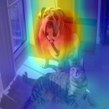
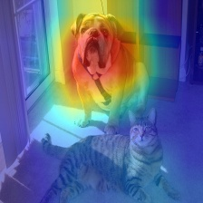
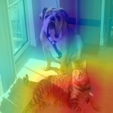
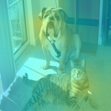
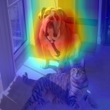
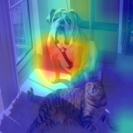
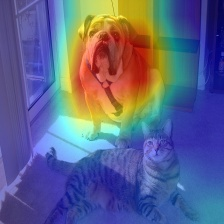
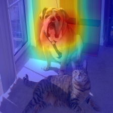
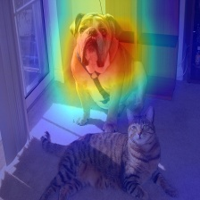
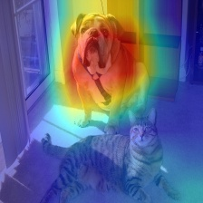

# 论文

**论文名称：**
[Grad-CAM++: Improved Visual Explanations for Deep Convolutional Networks](https://arxiv.org/abs/1710.11063)

**数据集：**
无 

**pytorch项目地址：**
[grad-cam](https://github.com/jacobgil/pytorch-grad-cam)

-----

# 最新进展

⭐ 支持的8个method为：gradcam、scorecam、gradcam++、ablationcam、xgradcam、eigencam、eigengradcam、layercam。

| Method   | What it does |
|----------|--------------|
| GradCAM  | Weight the 2D activations by the average gradient |
| GradCAM++  | Like GradCAM but uses second order gradients |
| XGradCAM  | Like GradCAM but scale the gradients by the normalized activations |
| AblationCAM  | Zero out activations and measure how the output drops (this repository includes a fast batched implementation) |
| ScoreCAM  | Perbutate the image by the scaled activations and measure how the output drops |
| EigenCAM  | Takes the first principle component of the 2D Activations (no class discrimination, but seems to give great results)|
| EigenGradCAM  | Like EigenCAM but with class discrimination: First principle component of Activations*Grad. Looks like GradCAM, but cleaner|
| LayerCAM  | Spatially weight the activations by positive gradients. Works better especially in lower layers |

⭐ 支持的smoothing模式为aug_smooth和eigen_smooth。

To reduce noise in the CAMs, and make it fit better on the objects, two smoothing methods are supported:

- `aug_smooth=True`

  Test time augmentation: increases the run time by x6.

  Applies a combination of horizontal flips, and mutiplying the image
  by [1.0, 1.1, 0.9].

  This has the effect of better centering the CAM around the objects.

- `eigen_smooth=True`

  First principle component of `activations*weights`

  This has the effect of removing a lot of noise.

⭐ 使用的模型为resnet50。

./models/torch2paddle.py脚本：用于保存torchvision.models.resnet50的预训练模型到本地；

将resnet50 torch的预训练模型`resnet50.pth`转换为resnet50 paddle的预训练模型`resnet50.pdparams`。

⭐ 默认加载的图片input_img为./examples/both.png。

----------

# 运行命令

Usage(默认为CPU环境、不使用smooth模式):

`python cam.py --image-path <path_to_image> --method <method>`

CUDA环境下不使用smooth的运行命令:

`python cam.py --image-path <path_to_image> --use-cuda --method <method>`

使用aug_smooth的运行命令：

`python cam.py --image-path <path_to_image> --method <method> --aug_smooth`

使用eigen_smooth的运行命令：

`python cam.py --image-path <path_to_image> --method <method> --eigen_smooth`

使用aug_smooth+eigen_smooth的运行命令：

`python cam.py --image-path <path_to_image> --method <method> --aug_smooth --eigen_smooth`

----------

## 实验过程

**1、**
注释掉有关gb和cam_gb的部分，只查看cam_image结果，将支持的8个method结果保存在/log/output_paddle文件夹下。

其中：

- log_no_smooth文件夹下是不使用smooth的8个method的结果。

- log_aug_smooth文件夹下是aug_smooth模式下的8个method的结果。

- log_eigen_smooth文件夹下是eigen_smooth模式下的8个method的结果。

- loh_aug_eigen_smooth文件夹下是aug+eigen smooth模式下的8个method的结果。

**2、**
同理将pytorch的8个method结果cam_image保存在log/output_torch文件夹中。

其中：

- log_no_smooth文件夹下是不使用smooth的8个method的结果。

- log_aug_smooth文件夹下是aug_smooth模式下的8个method的结果。

- log_eigen_smooth文件夹下是eigen_smooth模式下的8个method的结果。

- loh_aug_eigen_smooth文件夹下是aug+eigen smooth模式下的8个method的结果。

----

# 结果对比

## smooth模式结果对比

|smooth模式|AblationCAM | aug smooth | eigen smooth | aug+eigen smooth|
|---------|------------|------------|--------------|--------------------|
|paddle实现|  |  |  |  | 
|torch实现|  |  |  |  | 

----

## 8种method结果对比

|Method|Paddle|Pytorch|
|------|------|-------|
|GradCAM| ||
|ScoreCAM|| |
|GradCAMPlusPlus| ||
|AblationCAM| ||
|XGradCAM| ||
|EigenCAM| ||
|EigenGradCAM| ||
|LayerCAM| ||

----

# 总结

⭐ 对比了pytorch和paddle对于相同输入（both.png）的输出结果cam_image

⭐ 各method、各smooth模式下，比较cam_image的.npy文件，pytorch和paddle完全一致。

--------------------